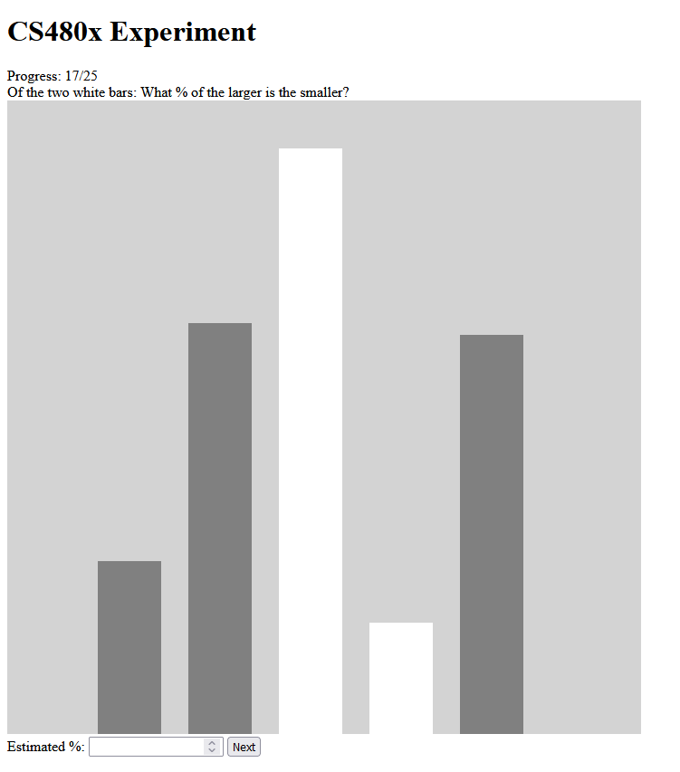
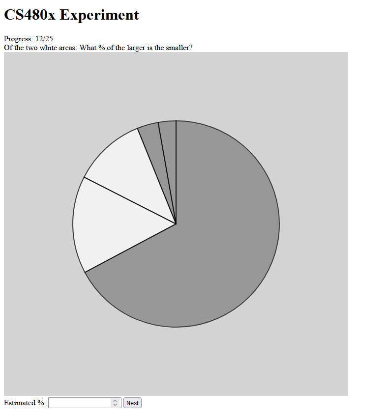
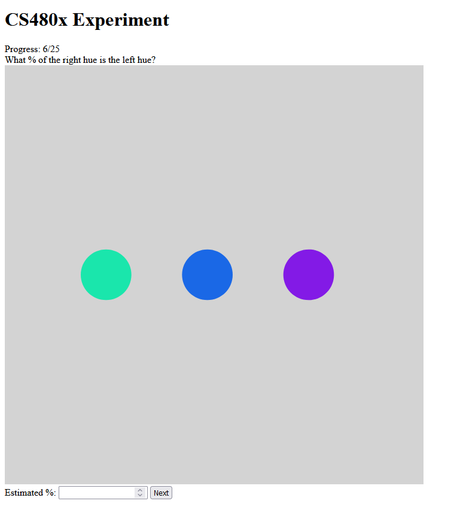
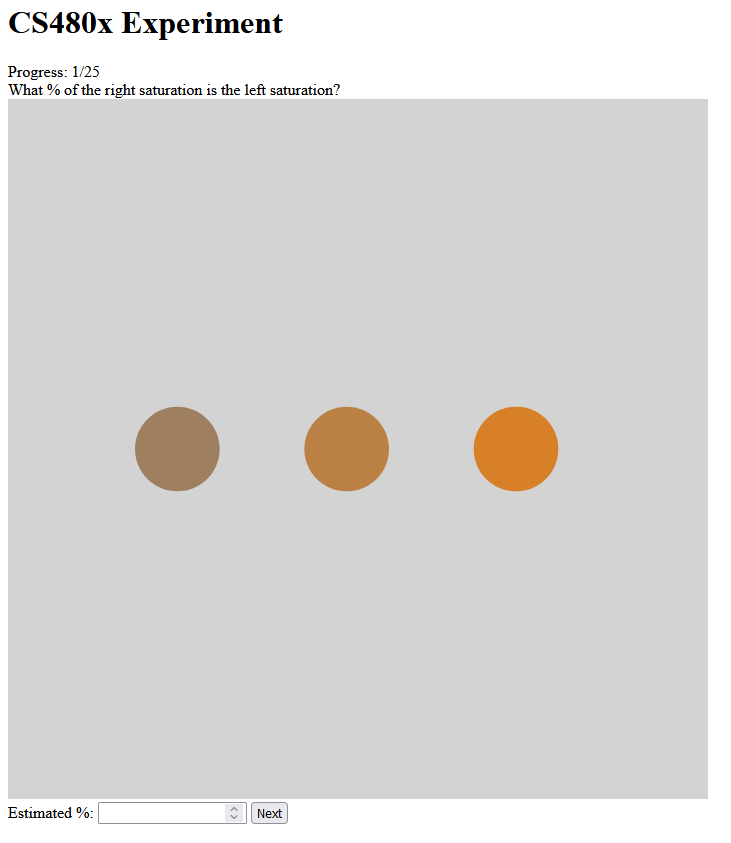
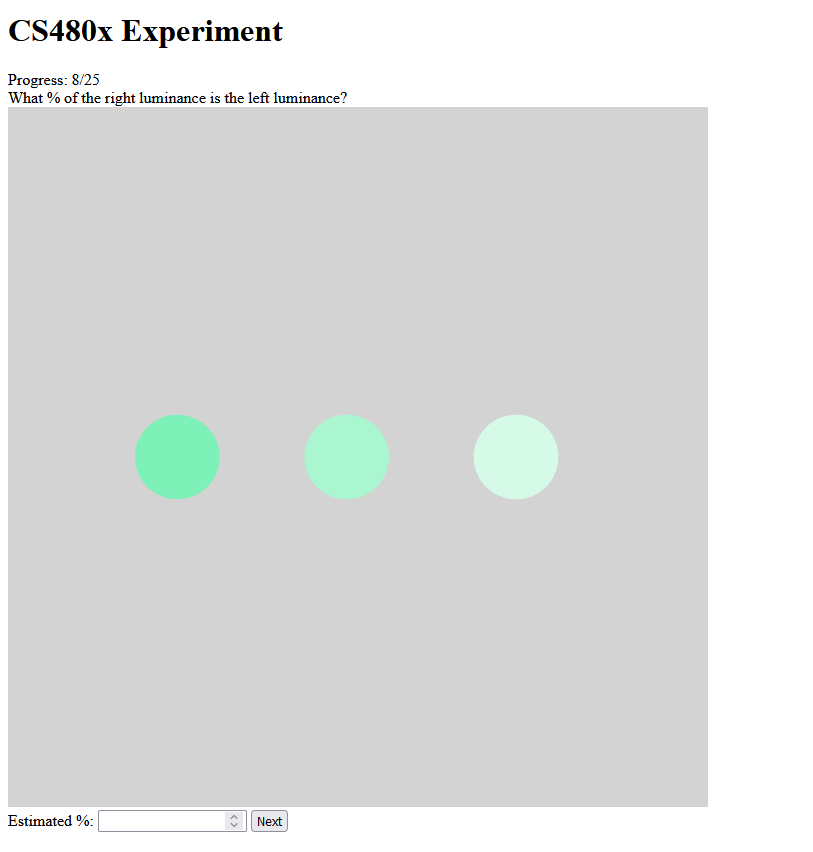
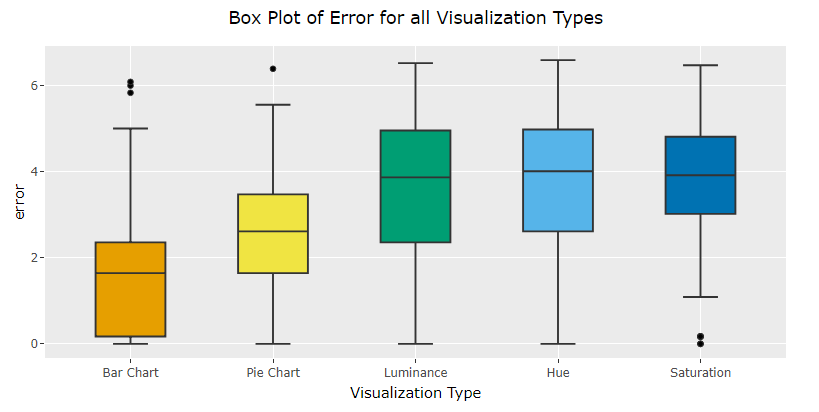
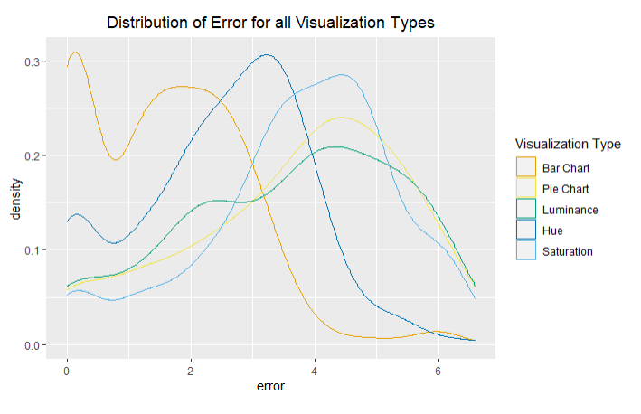
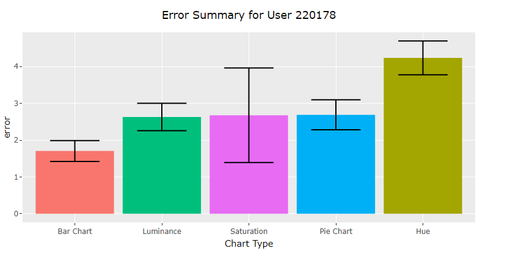

[Link to experiment](https://joshuamalcarne.github.io/a3-Experiment/)
 
Experiment Description
---
We compared the effectiveness of various visualization types in allowing people to discern the size of different data points. These visualization methods include bar charts, pie charts, hue, saturation, and luminance. The survey consisted of 25 trials, with 5 trials for each visualization type.
 
When working with bar and pie charts, participants were given five random data points, two of which were highlighted. They were tasked with finding what percentage of the larger data point the smaller data point was and to input their answer into a text box.

When working with hue, saturation, and luminance color scales, participants were presented with 3 circles in a line in increasing color value, with the middle circle in equal proportion with the left and right circle within the color scale being used. Participants were prompted to figure out what percentage of the right circle's color value the left circle was. The decision to use 3 circles came about when Professor Harrison suggested that we trim our previously 5 circles down to 3. After researching more about color triads, we decided this made the prompts much easier to interpret.

 
Data Analysis and Ranking Visualizations
---
Overall, we collected data from over 1,000 trials, with at least 200 trials performed on each visualization type. Error was calculated using McGill and Cleveland's logarithmic scale and plotted into a ranked bar chart. The ordering of the types, from lowest error to highest error, is as followed:
 
1. Bar Chart: **mean error** of **1.58** +/- 0.068
2. Pie Chart: **mean error** of **2.50** +/- 0.087
3. Luminance: **mean error** of **3.58** +/- 0.110
4. Hue: **mean error** of **3.71** +/- 0.126
5. Saturation: **mean error** of **3.76** +/- 0.103
 
Our findings for bar charts and pie charts are consistent with Cleveland and McGill's results as well as the additional crowdsourced results included in the assignment page. Our findings for color scales generally match the convention that luminance scales are more effective than hue scales as well.

 
Design Achievements
---
* Instructions given to match each trial
    * Helps participants understand the survey better, leading to more accurate results
* Error message for improper input
    * Notifies participants when they input a numeric value outside the accepted range of [0.01, 100]
* Progress tracker at the top of the page
    * Displays current progress out of 25 total trials
* Survey graphs follow pleasant color schemes
    * Used grey-brown-orange for saturation, white-aqua-green for luminance, all colors for hue, and ashen gray-white for pie and bar charts
* Data scales with content plane size
    * Allows for consistent proportions of data values across different hardware devices and enables loading on mobile devices
* Color-blind-friendly scale used for error analysis charts
    * Helps improve the accessibility of analysis and makes differentiating between data points easier
* Consistent style maintained in error analysis charts
    * Colors consistently map to the same visualization type, general color scheme and layout follows the same design
* Multiple chart types used for error analysis
    * Bar plot, box plots, and density plots were all used to help communicate and compare the data
 
Technical Achievements
---
* Linked backend to Google Sheets for data collection
    * Used Google Forms to add trial results to Google Sheets in real-time
* Perfect score on all Lighthouse Performance Test Scores (see img folder)
    * Survey website scored 100 in all categories tested
* Survey only accepts proper input from the user and an error message is given otherwise
    * Letters and numeric values outside the specified range cannot be inputted and sent as a response for a trial
* Survey loads and works properly on mobile devices
    * Increases survey accessibility
* Trials appear in pseudo-random order
    * Participants will receive the trials in a random order, including across visualization types. This helps correct for any learning curve participants may have when taking the survey.
* Graphed data for each trial randomly generated
    * The two data points being compared are in random proportion to each other, allowing data to be distributed evenly
* HSL Values Used
    * Made isolating and testing the color scales of hue, saturation, and luminance possible
* Error analysis graph generated for each participant who fully completed the survey
    * Parsed through csv file to display data for unique users, allowing analysis of error data for individual participants
* Interactive tooltip integrated into error analysis plots
    * Displays exact values of error for bar plot and specific data points for box plot