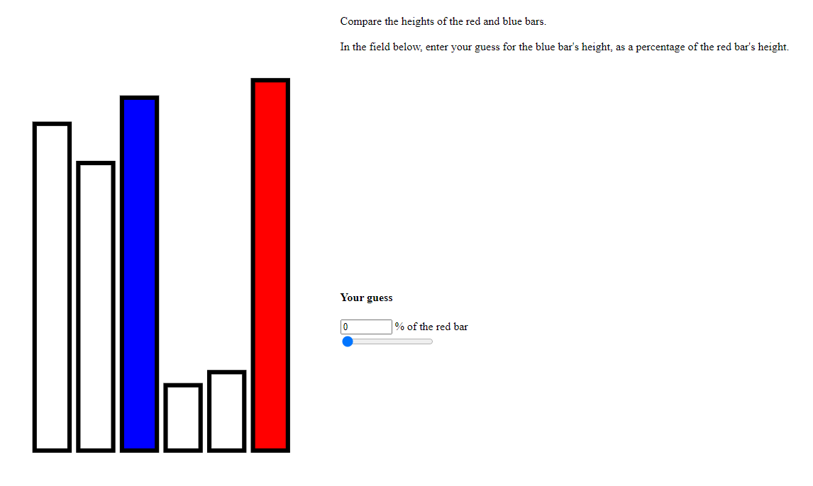
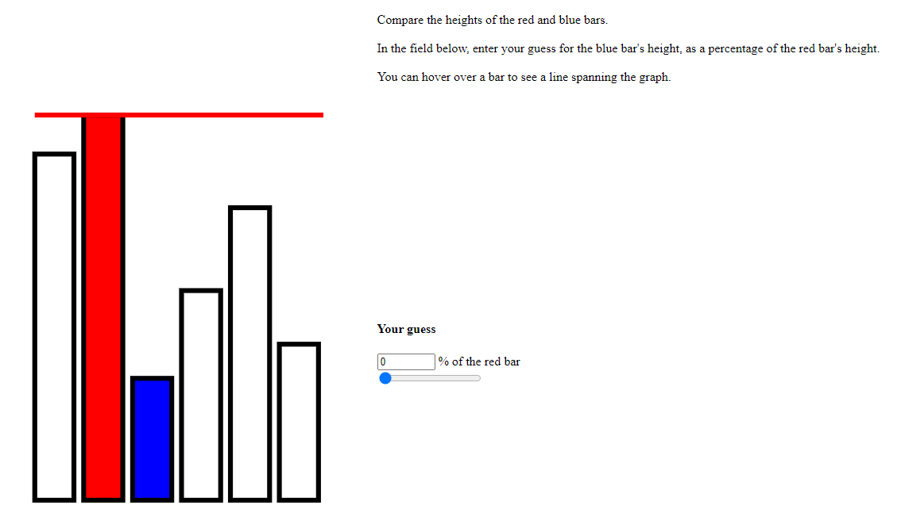
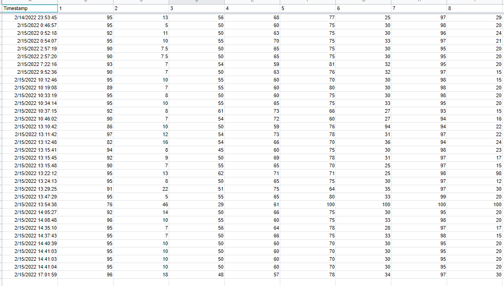
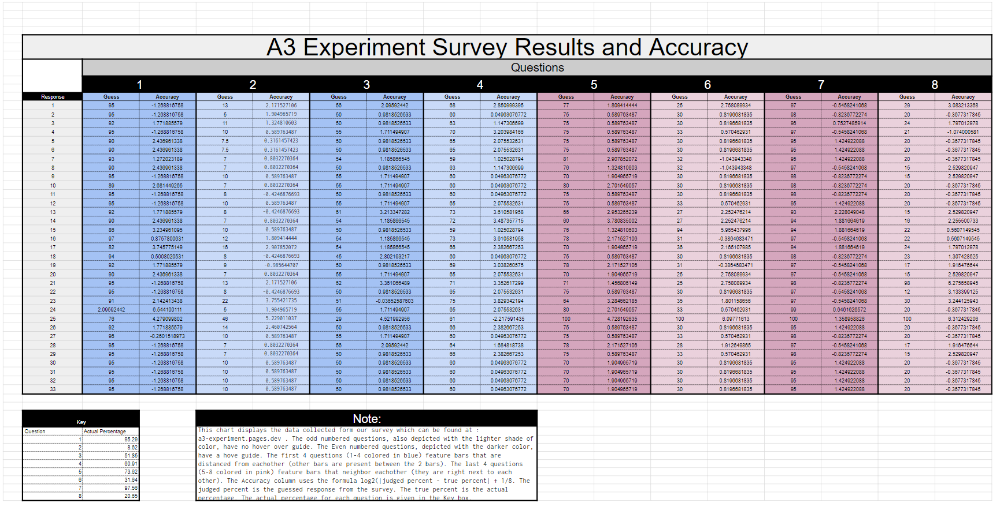

Assignment 3 - Replicating a Classic Experiment  
===
Team:
Marko Vila, Brian Fay, Drew Fisher, Dylan Shanes

Link to experiment page : [a3-experiment.pages.dev](a3-experiment.pages.dev)

The experiment:

The goal of our experiment was to see how different visuals can affect a user's ability to read a bar graph.
For this experiment, we chose to observe how guess accuracy was affected by the separating of the bars. That is, testing to see
if having neighboring vs separated bars would affect accuracy. In addition, we tested how adding an assistance line that would appear
when the user hovers over each individual bar would help with accuracy.

We started our experiment on a welcome page where we introduced that we are testing the precision and accuracy
of bar chart measurements with and without assistance. We also included that the survey would only take about 3 minutes to complete.

Then, we presented the user with 8 different questions. Each question featured a set of 6 bars. We prompted users to compare
the heights of the red and blue bars. Their goal is to estimate the blue bar's height as a percentage of the red bar's height.
In order to input the guesses, we provided an input box where users would input a number from 0-100 to indicate the percentage.
We also provided a slider bar for people to provide input. This can be seen in the screenshot below: 



For the bars in the last 4 questions of the surver (5-8), we provided a line that a user could make appear over each bar that they hovered their mouse over.
this can be seen below:



Once a user enters a guess, they click on the numbers on the bottom of the page to move to the next question. Once all the 
questions are answered, they press submit. This records their answers automatically onto a Google sheet seen below.



After collecting our data, we put it into a chart on Google Sheets for analysis: That can be found at the link:

https://docs.google.com/spreadsheets/d/1XMlvQHWv7gMeRwPbLvqc2V0z0jG0CKBtHnsB3eO1I8k/edit?usp=sharing

or in the screenshot below:


The results chart above lists all the questions and what each respondent recorded for each question. The first 4 questions (1-4)
had bars that are distanced from each other, while questions 5-8 had bars that were right next to each other. The chart indicates this
with the 2 different colors for each set of questions. The odd questions didn't have the hover over line assistance, while the even questions did.
This was reflected with a difference in the shade of the blue and pink. The key at the bottom of the chart is the actual percentage value that the blue bar was 
of the red bar. In order to calculate those values, we used the formula log2(|judged percent - true percent| + 1/8. Where judged percent is
the guess the user inputted and the true percent is the actual percentage. 


# Design Achievements
* The results chart is broken down and organized well. It breaks each question down into the responses and the accuracy.
* The result chart also reflects whether or not the questions have a line or not or are neighboring bars or not. 

# Technical Achievements
* Svelte/SvelteKit were used for quicker, component driven layout of an application, using reactive variables for more easily understandable state management
* Use of Cloudflare Pages for hosting means each commit gets built and served as a static site. Since the static site requires running `npm run build`, the automated deployment ensures that this is run before publishing, even if the commit author didn't run this step before pushing their changes.
# How to develop
---

After cloning the repo, run `npm install` (or `pnpm install` or `yarn`).
To start a development server:

```bash
npm run dev

# or start the server and open the app in a new browser tab
npm run dev -- --open
```
