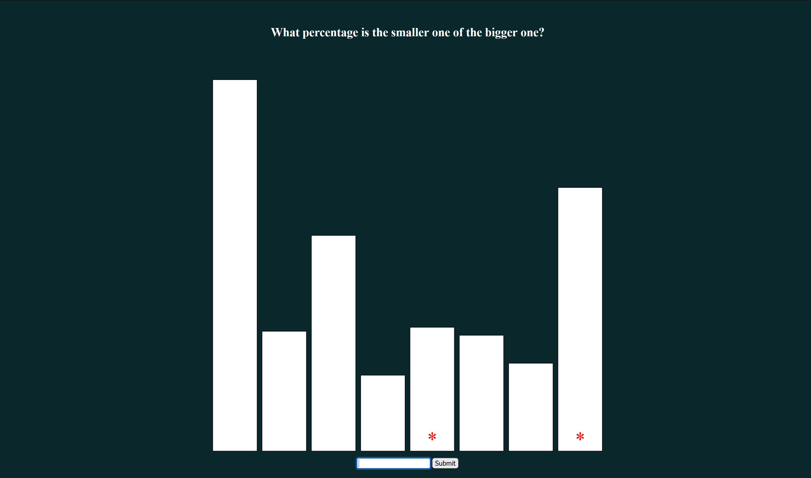
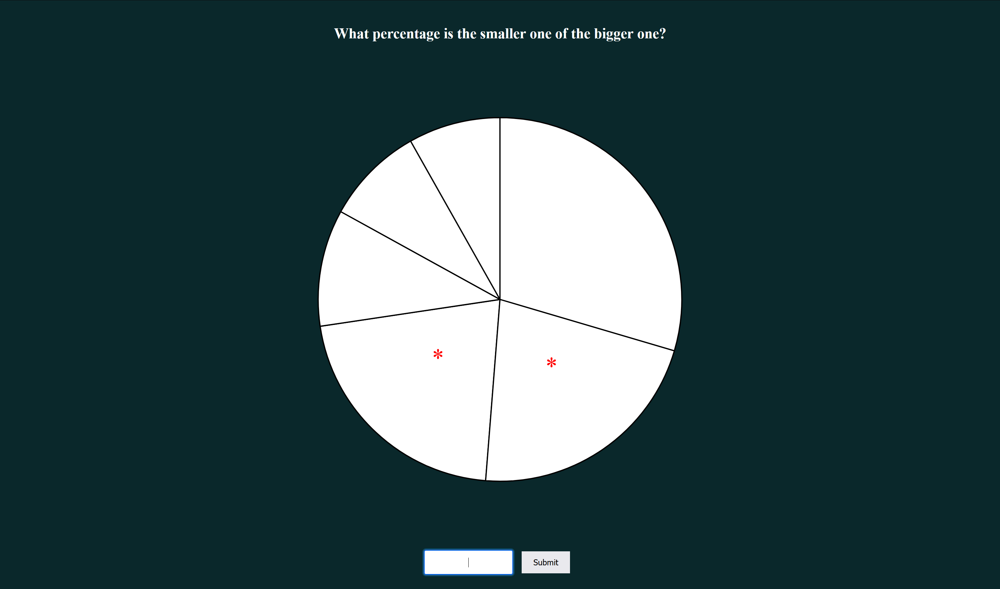
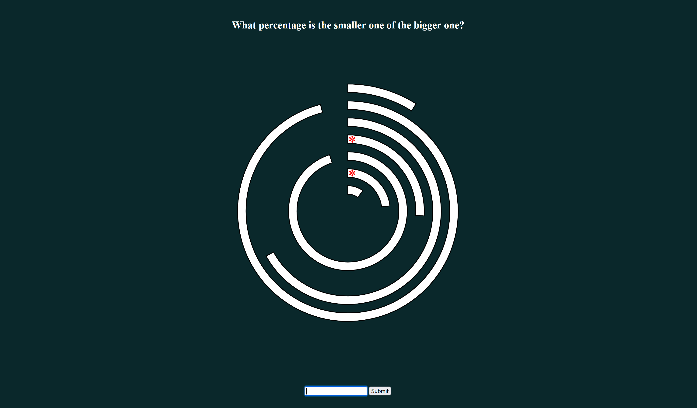
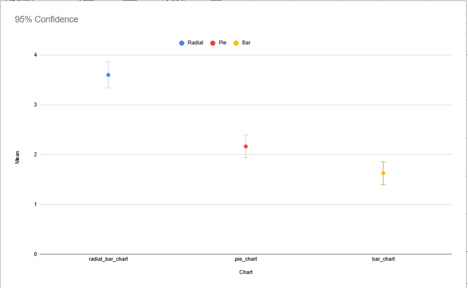
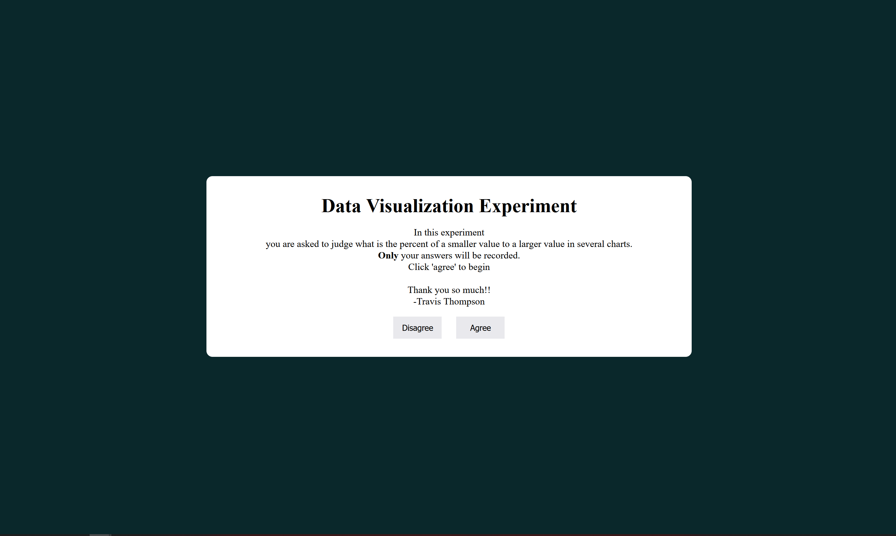

Assignment 3 - Experiment
===
Website Link:
https://travisthomp.github.io/a3-Experiment/dist/index.html

Experiment Concept
---
I wanted to test how circular data effects the user's ability to read it. I used the pie chart and bar chart to create a base reference for testing the Radial Bar Chart.

Project Overview
---
For my experiment I used a
- Bar Chart

- Pie Chart

- Radial Bar Chart

Experiment Results
---

The worst performing Visulization was the Radial Bar Chart by far :().

The best performing Visulization was the Bar Chart and the Pie chart was just a little worse than the pie chart.

I think the Radial Bar Chart might perform better if the data is sorted or if there alternating color of the arcs to make them more distinguishable (might be fun to test later)

Technical Achivements
---
* Used object orientated code design (Made a really nice Chart partent class to make it easy to add new charts!)
* Used a radial bar chart
* Displayed a score to the user

Design Achivements
---
* Created a landing page that explained the experiment to the user

* Removed the ugly bevel of the button and make it look nicer
* Make the input box look nicer
* Allowed user to press *Enter* to increase the speed of taking the experiment :)