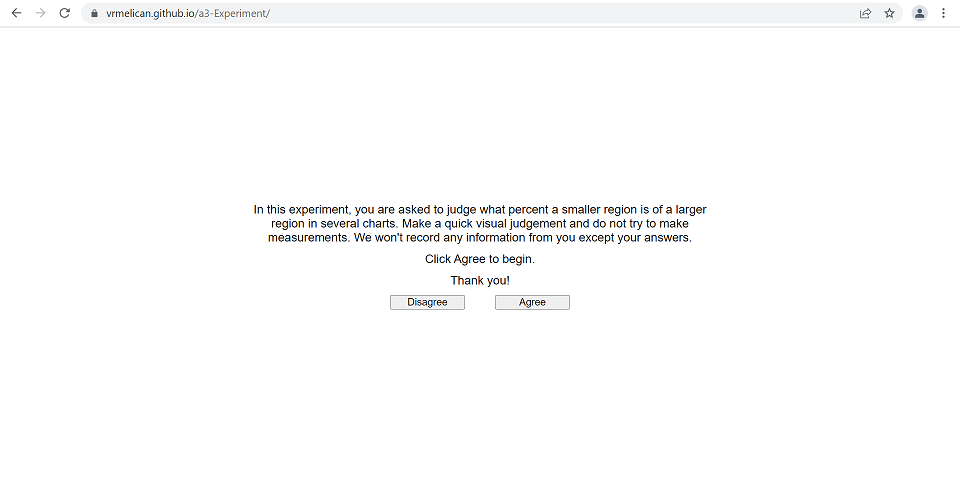
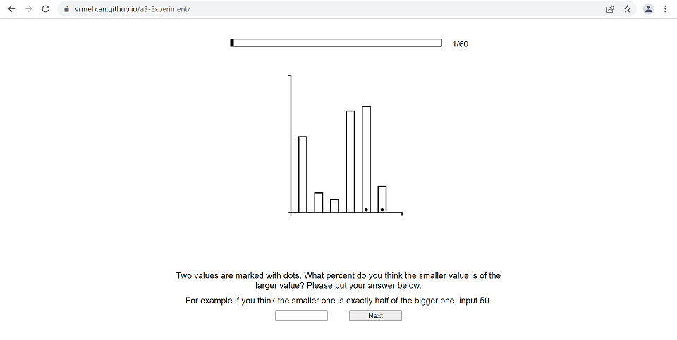
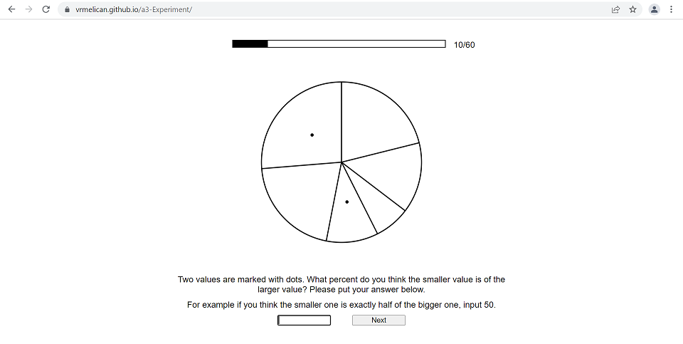
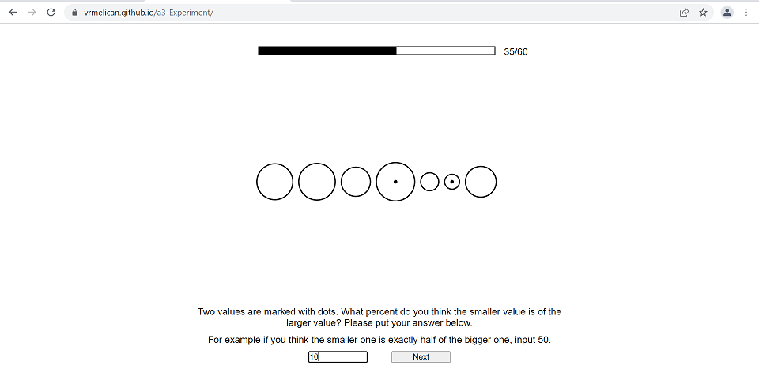
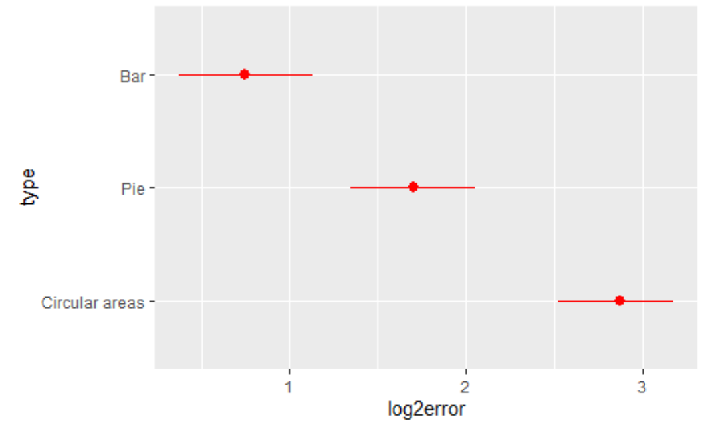

# Assignment 3 - Replicating a Classic Experiment  

## Experiment
Link: https://vrmelican.github.io/a3-Experiment/

In this experiment, participants were asked to evaluate what percentage a smaller region in a chart was of a larger region. Using Python, we generated 20 datasets with between 5 and 10 numbers. In each dataset, two values were selected randomly to be compared. We used three types of graphs, resulting in 60 graphs for each participant. In addition to the bar charts and pie charts, we also decided to add circle charts. We hypothesized that people would perform better on bar charts than pie charts, and worst on the circle charts because it is difficult to compare the areas of circles. Graphs were drawn using d3, with regions to be compared marked with dots. JavaScript was used to create the UI. Each of our ten participants were given the charts in random order. At the end of the survey, a JSON that contained the id of each chart and the particpant's response was logged to the console. We converted these to .csv files and saved them individually. We combined all the results into one file at the end for analysis.

Start page:

Bar chart:

Pie chart:

Circle chart:

## Results

The results of our experiment were as to be expected. The bar charts had the least error, the pie charts had the second to least error, and the circle charts had the most error. This aligns with the crowdsourced results in which position charts (the bar chart) have less error than angle charts (the pie chart), which have less error than circular area charts (the circle chart). 

## Technical and Design Achievements
For the technical achievement, we tried to follow the constraints of the data generation from the original study as closely as possible. This included making sure that all values were between 3 and 39, summed to 100, and had a sepration of more than 0.1. In addition, we selected a wide distribution of ratios between the two selected values so we could capture the range of possible responses. To do this, we generated a large number of datasets, then selected ones that had ratios of 5% to 100% (going up in intervals of 5). One limitation was that with the data constraints from the original study, it was not possible to generate a dataset that had a 5% difference. So, we decided to manuallly create data for this case. For the design achievement, we made sure that the user interface looked good. One challenge was centering the graphs on the page. We also decided to add a progress bar in addition to the page numbers to give users a better sense of how far they were.
