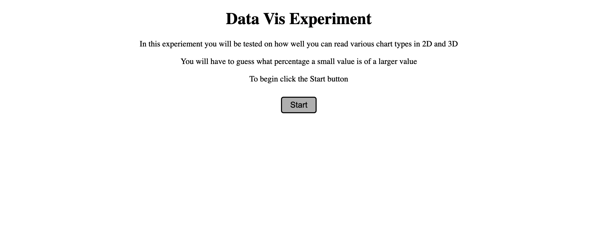
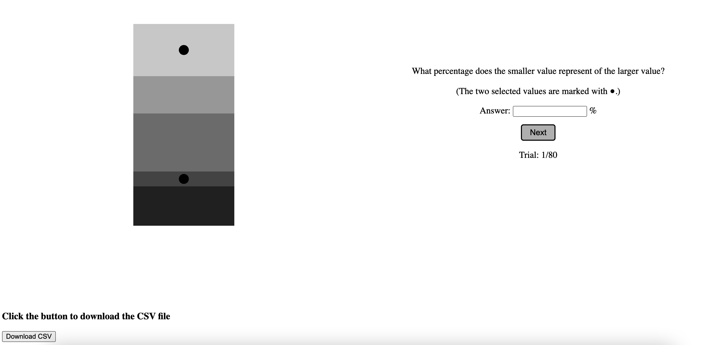
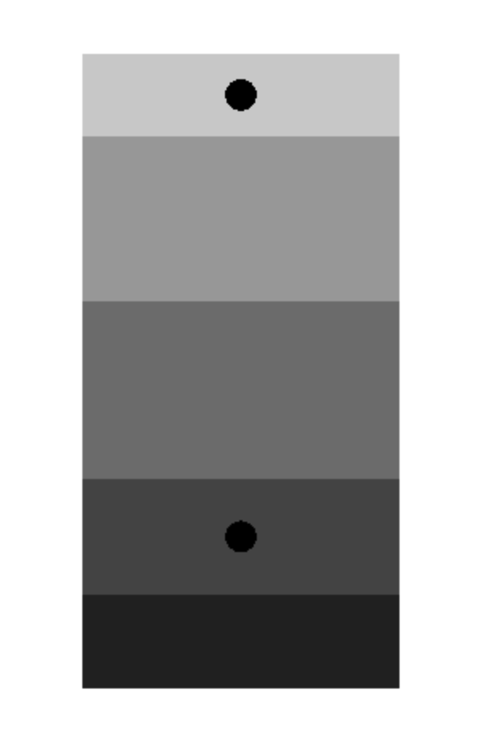
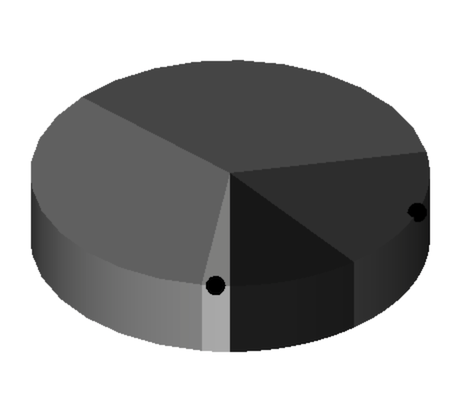
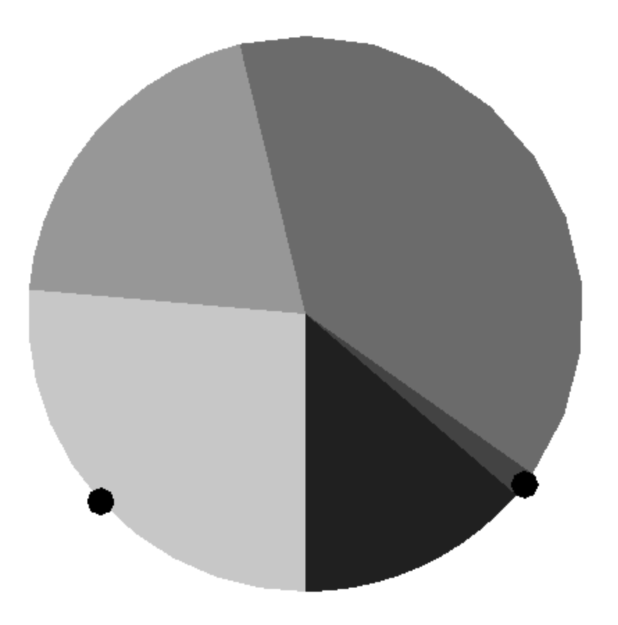
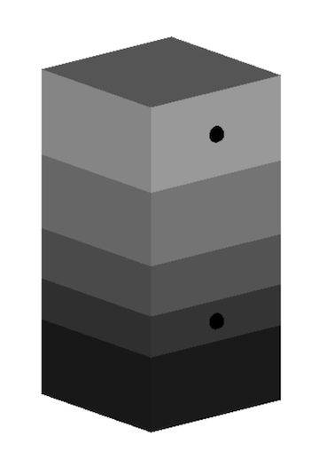
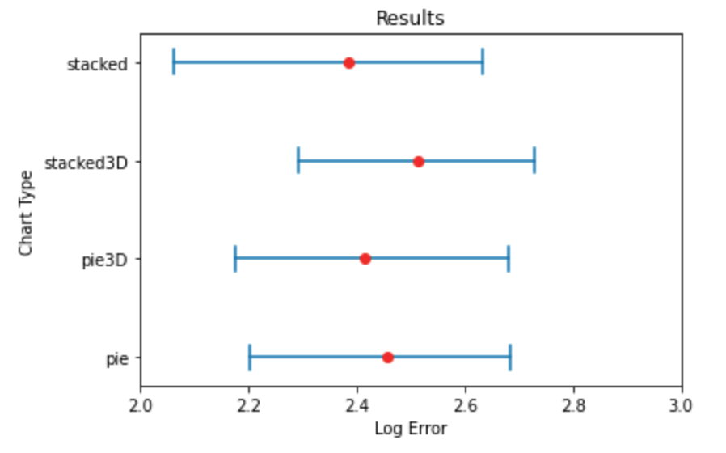

Assignment 3 - Replicating a Classic Experiment  
===

Link: https://mkelly1510.github.io/a3-Experiment/

Experiment
---

We created an introduction page for the experiment to give the user a quick overview of the experiment and what they will be doing in it. When the user clicks the start button it will generate a random participant ID between 1 and 999 which we included as an attribute in our csv of the data.

We created all the charts in three.js. We generated random data with numbers between 1 - 100 for each of the 5 indices of the chart. Then we chose 2 numbers between 0 - 4 and those were the two indices that were going to be compared. We created a function called generateChart() that used helper functions to create either a pie or stacked bar chart. Within these helper functions there was a part that would generate the 3D chart is chosen and would adjust the chart angles so the chart would appear in 3D. We put these graphs in a canvas element
and aligned it with the html text on the webpage. The text gives short instructions on how the user needs to answer the question. It will handle errors in the user answers, such as the answer being over 100. When the user clicks the next button the trial counter will update and a new graph will appear. Since we chose to do 4 graphs and each graph needed at least 20 trials, we have a total of 80 trials. We chose to use stacked bar and pie charts because a stacked bar chart is just a pie chart that has been rotated around a center point and the center is filled in. This way we can have a control by having technically the same chart types but we can test the difference in performance between positions versus angles. We chose to test the same chart types but in 3D. By doing this we can still test the difference in performance between pie and stacked bar charts but in 3D and we can test the difference in performance between 2D and 3D charts. Below are screenshots of the chart in the order of best performance to worst performance.

Stacked Bar Chart
---

3D Pie Chart
---

Pie Chart
---

3D Stacked Bar Chart
---

Results
---

We used python to generate these results. As you can see the average log2error for all charts is surprisingly close with the largest average error being 2.52 and the lowest being 2.39. We expected the error to be much higher on the 3D charts and the pie charts. Although the error was close, our expectations on the 2D stacked bar charts were correct. The 2D stacked bar chart performed the best and the 3D stacked bar chart performed the worst out of all 4 charts. For the pie charts, the 3D chart performed slightly better than the 2D one. The 3D pie chart had an error of 2.41 while the 2D pie chart had an error of 2.46. We expected the pie charts to perform worst than the stacked bar charts because it is harder to analyze angle than positions. The 2D pie chart did perform worst than the 2D stacked bar chart, but it 3D version actually performed better than the 3D stacked bar chart. The confidence interval variance was almost the same for all of the chart, but the 2D stacked bar chart was noticeably larger.

Technical Achievements
---
- Created 3D versions of the pie and stacked bar charts in order to compare performance between 2D and 3D charts.
- Created 4 charts instead of 3 which was the requirement
- Was able to prove through log2error that 2D charts did perform better than 3D charts for stacked bar chart, but not for pie charts

Design Achievements
---
- Used three.js to set chart angles and camera angles to make the charts appear in 3D
- Put the download csv button below the webpage frame so users wouldn't immediately see it when they took the experiment
- Added user error checking for non-number inputs and numbers over 100.
