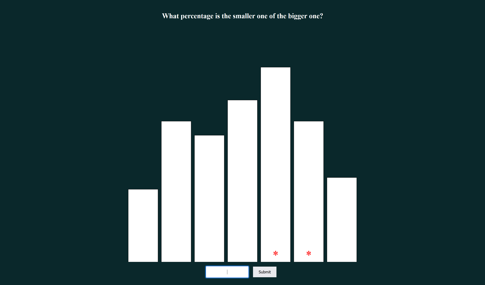

Assignment 3 - Experiment
===

Experiment Concept
---
I wanted to test how circular data effects the user's ability to read it. I used the pie chart and bar chart to create a base reference for testing the Radial Bar Chart.

Project Overview
---
For my experiment I used a
- Bar Chart

- Pie Chart

- Radial Bar Chart

Experiment Results
---
TBA

Technical Achivements
---
* Used object orientated code design
* Used a radial bar chart
* Displayed a score to the user

Design Achivements
---
* Created a landing page that explained the experiment to the user

* Removed the ugly bevel of the button and make it look nicer
* Make the input box look nicer
* Allowed user to press *Enter* to increase the speed of taking the experiment