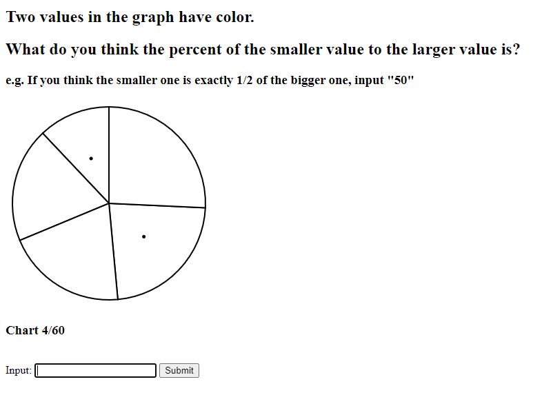

Assignment 3 - Replicating a Classic Experiment  
===
By: Matthew Aguiar

Link to Web App: https://assignment3cs410x.firebaseapp.com/

Experiment Results
---
 
My experiment tested three different types of charts: Pie Charts, Horizontal Bar Charts, and Vertical Bar Charts.
During the experiment, users needed to guess what percent smaller one randomly selected data point was from another.
The goal is to determine which chart type is the most accurate in conveying data.
I will now go over the results of this experiment and explain the rankings.

###Raw Data

Here is an image of the raw data collected for this assignment. It consists of 240 trials. You can view this spreadsheet
in this repository. It is named "assignment3.csv". The results were compiled from my web app linked above and stored in a
Firebase Database. I then downloaded the Database JSON and converted it into the CSV you see here.

###Rank 1: Vertical Bar Chart

According to the log2error calculations the vertical bar chart was the most accurate in terms of user guesses. It's average log2error
was 2.2461. I could tell as I was doing a few trials myself how it was much more difficult than I anticipated to analyze a percent
difference between two arcs of a pie than two bars of a bar chart. The bars really allow you to get a good side by side view.

###Rank 2: Horizontal Bar Chart

According to the log2error calculations the horizontal bar chart was the most accurate in terms of user guesses. It's average log2error
was 2.2999. It was very similar to the vertical bar chart because you still have bars side by side.

###Rank 3: Pie Chart
According to the log2error calculations the pie chart was the most accurate in terms of user guesses. It's average log2error
was 2.8198. As I stated, it seemed much more difficult to analyze how much smaller some arcs were than others.

###Bootstrapped 95% Confidence Intervals
I gave this part of the project my best shot, but it was very confusing to be how to create this chart. I followed
many tutorials and after hours of failure, seeing that I successfully calculated the log2error of each chart and
ranked them, I decided to skip this part. My attempt at this part is in the folder Bootstrap and used R to try to plot the 
bootstrapped 95% confidence interval graph if that counts for anything.

Technical Achievements
---

1. **Object-Oriented Design** - One thing I'm proud of with this project is the object-oriented design I wrote for it. Each functionality
of the project is broken into classes. Everything starts in index.js and branches out to App.js and other files from there. Also,
I implemented some inheritance with Chart, BarChart and PieChart. Overall I was really happy with how the flow of the code played out!
2. **State Machine** - Another technical achievement was the implementation of a state machine to dynamically update the HTML of the page.
The state machine was broken up into START, EXPERIMENT and FINISH to control what HTML appears and what JS code to run. The START state
shows the introduction message and instructions. The EXPERIMENT state creates new charts and scores them. The FINISH state displays
thank you message.
3. **Firebase** - Finally, I learned how to use Firebase for this project which was awesome! It's such as great tool for
creating web apps. In order to record user's inputs, I sent their data off to my Firebase database. Then I downloaded the
database as a JSON file and converted the result into a CSV file.

Design Achievements
---

1. **Input Textbox** - One design achievement that really streamlined the data collection process was my input mechanism. Doing
60 trials per participant is a lot to ask of people, so I figured I'd make the input process as easy for the user as possible.
In the Cleveland-McGill experiment they had users input their answers into a textbox and click a submit button. However, for
60 charts this would get very tedious. So, I added one text box and to submit your answer you click the <enter> button.
The textbox remains selected and is cleared when the next chart is loaded so the user never has to use the mouse. Just keep
typing input and pressing enter. Now, this is a disadvantage for mobile users but to be fair this app wasn't designed to be
the most compatible to mobile.

2. **Simplistic UI** - The project stated that we could make the UI look a little better than the original experiment. 
I originally tried to add some fancy graphics and backgrounds, but it just seemed to get distracting. That's when I took
the minimalist UI approach. The purpose of the project is to collect data and the plain background and black text
makes it as straight forward for the user to understand the graphs.
